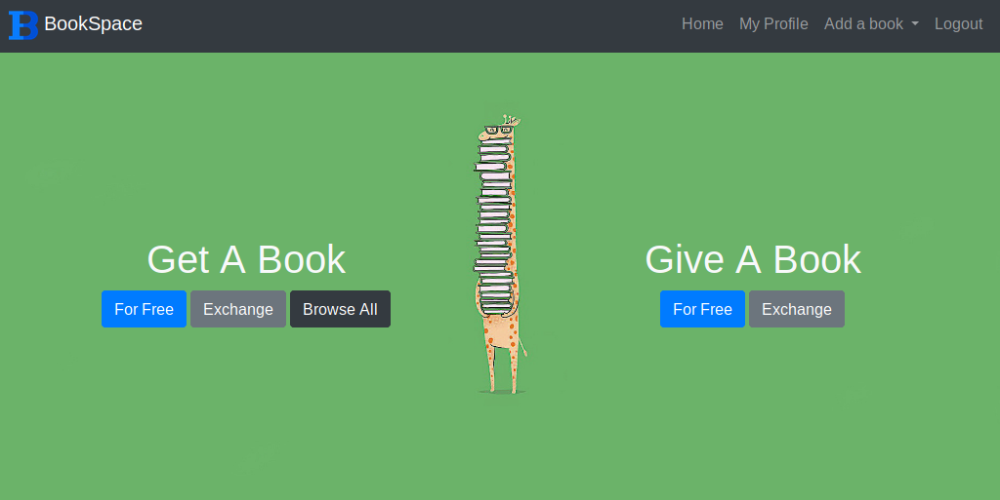

BookSpace is a webapp built on Django 2.1.3 enabling it's users to exchange the books they do not need with other users. the app offers possibility to "Give a book away for free" or "Exchange book with others".

It was started during during a Major League Hacking event "Porticode" hosted at UCL 18 November 2018.
